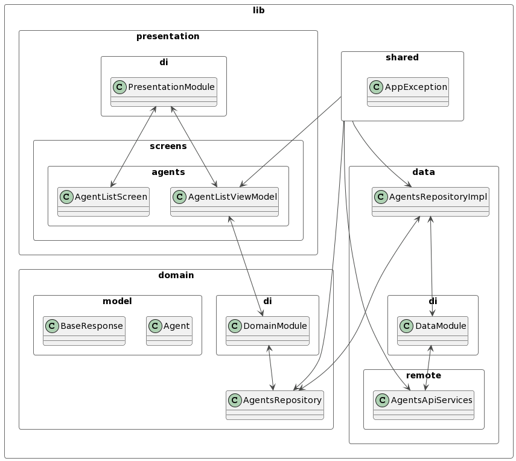

# Valorant Agents Show

Welcome to **Valorant Agents Show**, a Flutter app that showcases various agents from the game Valorant. This app fetches agent data from an API and presents it in an interactive and visually appealing manner.

[demo.webm](https://github.com/olololoe110399/valorant-agents-show/assets/58255731/2b8b118c-319e-4ed3-81f9-477034857f0a)


## Table of Contents

- [Features](#features)
- [Project Structure](#project-structure)
- [Libraries Used](#libraries-used)
- [Installation](#installation)
- [Usage](#usage)
- [Tests](#tests)
- [Contributing](#contributing)
- [License](#license)

## Features

- View a list of Valorant agents.
- Explore each agent's details, including name, portrait, and background.
- Navigate through agents using a horizontal picker.

## Project Structure

```YML
.
├── assets
│   ├── fonts
│   │   └── valorant_font.ttf
│   └── raw
│       └── bg.json
├── lib
│   ├── data
│   │   ├── di
│   │   │   └── data_module.dart
│   │   ├── remote
│   │   │   ├── agents_api_services.dart
│   │   │   └── agents_api_services.g.dart
│   │   └── agents_repository_ipml.dart
│   ├── domain
│   │   ├── di
│   │   │   └── domain_module.dart
│   │   └── repository
│   │       └── agents_repository.dart
│   ├── model
│   │   ├── agent.dart
│   │   ├── agent.g.dart
│   │   ├── base_response.dart
│   │   └── base_response.g.dart
│   ├── presentation
│   │   ├── di
│   │   │   └── presentation_module.dart
│   │   └── screens
│   │       └── agents
│   │           ├── agent_list_screen.dart
│   │           ├── agent_list_state.dart
│   │           ├── agent_list_state.freezed.dart
│   │           └── agent_list_view_model.dart
│   ├── shared
│   │   └── app_exception.dart
│   ├── theme
│   │   ├── app_color.dart
│   │   ├── app_theme.dart
│   │   └── app_type.dart
│   └── main.dart
├── test
│   ├── agent_list_screen_widget_test.dart
│   ├── agents_repository_integration_test.dart
│   └── app_exception_test.dart
├── LICENSE
├── analysis_options.yaml
└── pubspec.yaml

```

Architecture:



## Libraries Used

- [retrofit](https://pub.dev/packages/retrofit): A type-safe HTTP client for Dart using the Retrofit package.
- [freezed](https://pub.dev/packages/freezed): A code generator for unions/pattern-matching/copy.
- [dartz](https://pub.dev/packages/dartz): Functional programming in Dart.
- [lottie](https://pub.dev/packages/lottie): A library for using Lottie animations in Flutter.
- [hooks_riverpod](https://pub.dev/packages/hooks_riverpod): A simple way to manage state in your Flutter applications.
- [mockito](https://pub.dev/packages/mockito): Mock library for Dart.

## Installation

1 Getting Started:

Make sure you have Flutter and Dart installed on your machine. You can install them by following the instructions in the [official Flutter documentation](https://flutter.dev/docs/get-started/install).

2 Clone this repository:

```bash
git clone https://github.com/olololoe110399/valorant-agents-show.git
```

3 Navigate to the project directory:

```bash
cd valorant-agents-show
```

4 Install dependencies:

```bash
flutter pub get
```

## Usage

Run the app on a simulator or device:

```bash
flutter run
```

The app should start and you can explore the Valorant agents.

## Tests

The project includes unit tests, integration tests, and widget tests to ensure code quality and functionality. To run tests, use the following commands:

- Run tests

```bash
flutter test
```

## Contributing

Contributions are welcome! If you find any bugs or want to add new features, feel free to open an issue or submit a pull request. For major changes, please open an issue first to discuss what you would like to change.

Please make sure to update tests as needed.

## License

This project is licensed under the [MIT License](LICENSE).
